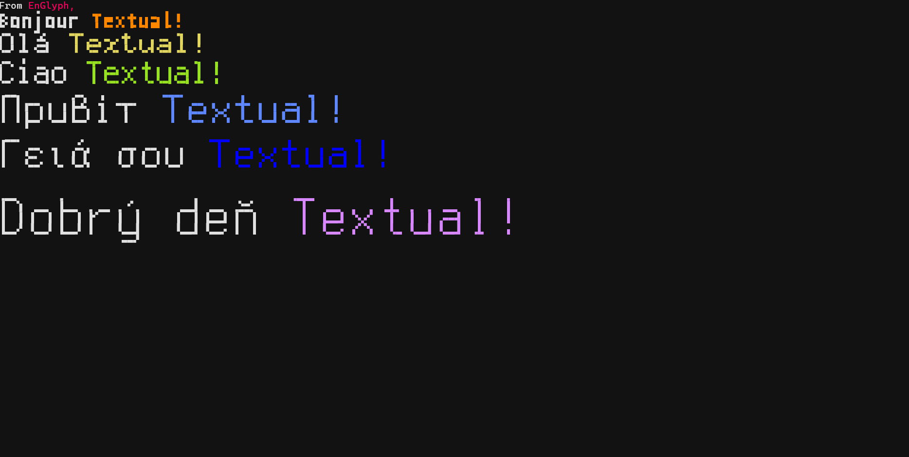

# Textual-EnGlyph

*A large font and image rendering widget for [Textual](https://textual.textualize.io/).*

[](https://pypi.org/project/textual-englyph/) [](./LICENSE) 



---

## ✨ Features

* Render **large text** with scalable bitmap/outline fonts in the terminal
* Support for **Unicode Symbols for Legacy Computing** block (Unicode 16.0)
* Compatible with **Textual** widgets/layouts
* Easy integration with `text_size`, `font_name`, `font_size` parameters
* Works cross-platform (Linux / macOS / Windows terminals that support Unicode)

---

## 📦 Installation

Using [`uv`](https://docs.astral.sh/uv/guides/) (recommended):

```bash
uv pip install textual-englyph
```

Or classic `pip`:

```bash
pip install textual-englyph
```

---

## 🚀 Quick Start

Create a file `text.py`:

```python
from textual.app import App, ComposeResult
from textual_englyph import EnGlyphText


class Demo(App):
    def compose(self) -> ComposeResult:
        yield EnGlyphText(
            "From EnGlyph, Hello [violet]Textual!",
            text_size="medium"
        )

if __name__ == "__main__":
    Demo().run()
```

Run:

```bash
uv run text.py
```

---

## 🖥️ Requirements

To see EnGlyph text correctly, you need:

* A terminal emulator that supports Unicode symbols (>= v16.0)
* A font with glyphs for the **Symbols for Legacy Computing** block

### Known Terminals

* iTerm2 (macOS)
* xfce4-Terminal (Linux)
* Windows Terminal
* …and many more

### Known Fonts

* [Cascadia Code](https://github.com/microsoft/cascadia-code/) v2404.3+
* [GNU Unifont](http://savannah.gnu.org/projects/unifont/) v16.0+
* [Iosevka](https://typeof.net/Iosevka/) v13.9.1+

---

## 📖 More

See [Overview.md](./Overview.md) for details about EnGlyph capabilities, font usage, and advanced options.
